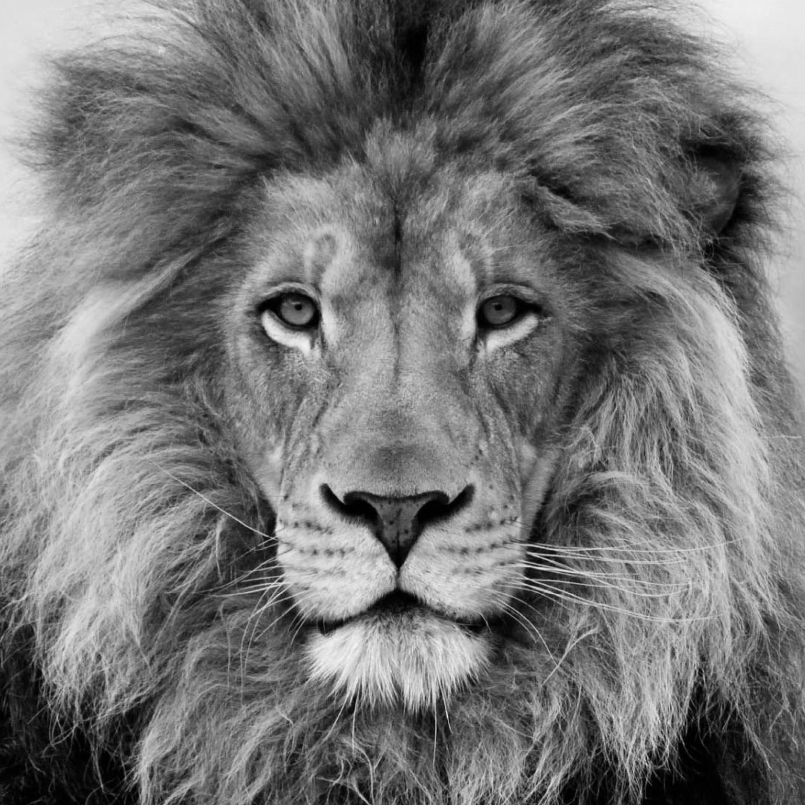
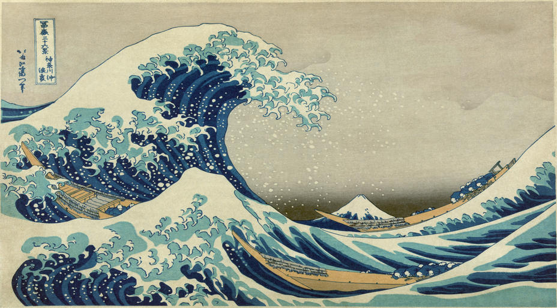
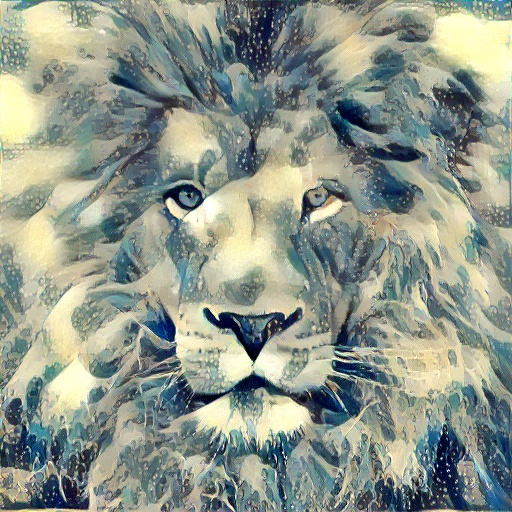

# Artify — Neural Style Transfer with VGG19

<div align="center">


**PyTorch implementation of Neural Style Transfer (Gatys et al., CVPR 2016) — apply the style of any painting to any photograph, via a Streamlit web app or command-line script.**

</div>

## Overview

Neural Style Transfer (NST) generates a new image that combines:
- the **content** of a photograph (shapes, structure, scene)
- the **style** of a painting (colours, textures, brushwork)

This implementation follows the original paper by Gatys et al., using a **pretrained VGG19** as a fixed feature extractor and optimising a noise image through gradient descent until it simultaneously matches the content and style representations.

| Content | Style | Result |
|---|---|---|
|  |  |  |

## How It Works

### Feature extraction — VGG19

The pretrained VGG19 is used as a **frozen feature extractor** (no training, no fine-tuning). It extracts feature maps at 6 layers:

| Layer | Used for |
|---|---|
| `relu1_1`, `relu2_1`, `relu3_1`, `relu4_1`, `relu5_1` | Style representation |
| `conv4_2` | Content representation |

Low-level layers capture textures and colours (style); deeper layers capture high-level structure (content).

### Content loss

Measures the mean squared error between the feature maps of the **generated image** and the **content image** at `conv4_2`:

```
L_content = MSE(F_generated[conv4_2], F_content[conv4_2])
```

### Style loss — Gram matrices

Style is captured via **Gram matrices** — inner products between feature channel vectors that encode correlations between features, independent of their spatial location:

```
G[l] = F[l] · F[l]ᵀ   (c × c matrix, where c = number of channels at layer l)

L_style = Σ_l MSE(G_generated[l], G_style[l])
```

### Total variation loss

Encourages spatial smoothness in the generated image, reducing high-frequency noise:

```
L_tv = Σ|x[i,j+1] - x[i,j]| + Σ|x[i+1,j] - x[i,j]|
```

### Total loss

```
L_total = λ_content · L_content + λ_style · L_style + λ_tv · L_tv
```

All three weights are configurable at runtime.

### Optimiser — L-BFGS

The **image itself** is the optimised variable (not any network weights). The optimiser is **L-BFGS** with strong Wolfe line search — recommended by Gatys et al. as it converges faster than Adam for this type of pixel-space optimisation problem.

The generated image is initialised as Gaussian noise scaled to the content image size (max 512px).

## Project Structure

```
artify/
├── main.py                     # CLI script — run NST from the command line
├── app.py                      # Streamlit web application
├── src/
│   └── model/
│       └── vgg.py              # VGG16 and VGG19 feature extractors (frozen)
├── data/
│   ├── content/                # Content images (lion, golden gate, rushmore…)
│   ├── style/                  # Style images (Van Gogh, Kandinsky, Monet wave…)
│   └── results/                # Generated triplet outputs
├── env.yml                     # Conda environment
└── models_notes                # Architecture and loss notes
```

## Setup

```bash
# Clone the repo
git clone https://github.com/thiernodaoudaly/artify.git
cd artify

# Create and activate the Conda environment
conda env create -f env.yml
conda activate nst-env
```

## Usage

### Option A — Streamlit app

```bash
streamlit run app.py
# → http://localhost:8501
```

Upload your own content and style images, adjust the loss weights (λ_content, λ_style, λ_tv) and number of iterations from the sidebar, and watch the image evolve in real time.

### Option B — Command line

```bash
python main.py \
  --content_img_name lion.jpg \
  --style_img_name wave.jpg \
  --model vgg19 \
  --content_weight 1e-3 \
  --style_weight 1e-1 \
  --tv_weight 0.0 \
  --niter 30 \
  --save_stylized_image
```

**Key arguments:**

| Argument | Default | Description |
|---|---|---|
| `--content_img_name` | `lion.jpg` | Content image filename (from `data/content/`) |
| `--style_img_name` | `wave.jpg` | Style image filename (from `data/style/`) |
| `--model` | `vgg19` | Feature extractor — `vgg16` or `vgg19` |
| `--content_weight` | `1e-3` | λ_content — higher = more content fidelity |
| `--style_weight` | `1e-1` | λ_style — higher = stronger style transfer |
| `--tv_weight` | `0.0` | λ_tv — higher = smoother result |
| `--niter` | `30` | Number of L-BFGS iterations |
| `--save_stylized_image` | off | Save result + triplet image to `data/results/` |

## Included Style Images

`afremov` · `candy` · `electro` · `frida_kahlo` · `kandinsky` · `la_muse` · `mosaic` · `munch` · `nude` · `rain_princess` · `vangogh` · `vangogh2` · `wave`

## Reference

Gatys, L.A., Ecker, A.S., Bethge, M. — *Image Style Transfer Using Convolutional Neural Networks* — CVPR 2016 · [PDF](https://www.cv-foundation.org/openaccess/content_cvpr_2016/papers/Gatys_Image_Style_Transfer_CVPR_2016_paper.pdf)

## License

MIT License — see [LICENSE](LICENSE) for details.
